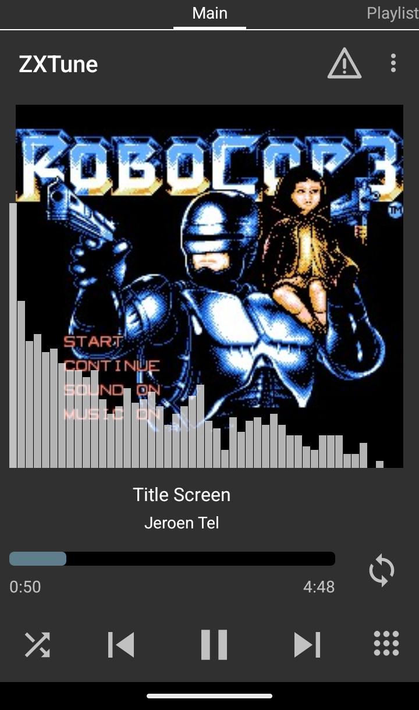
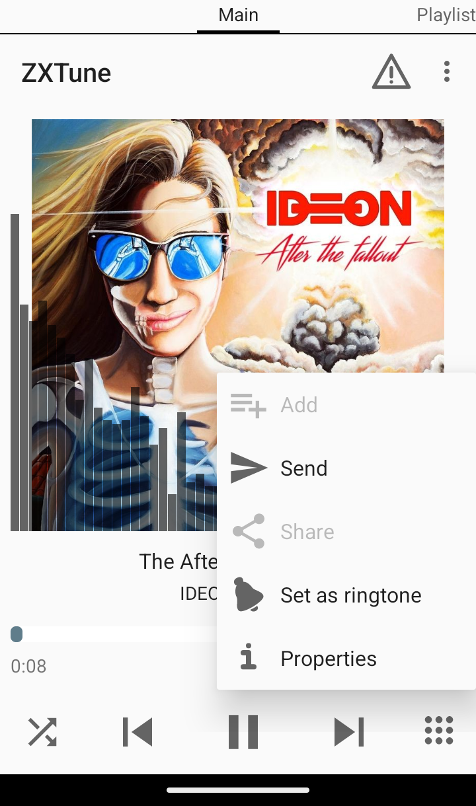
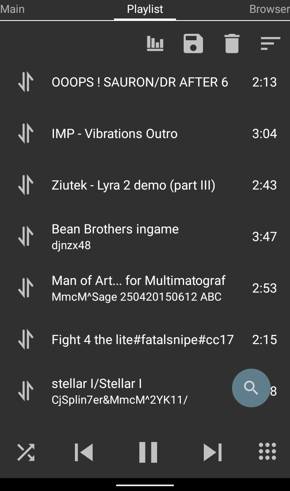
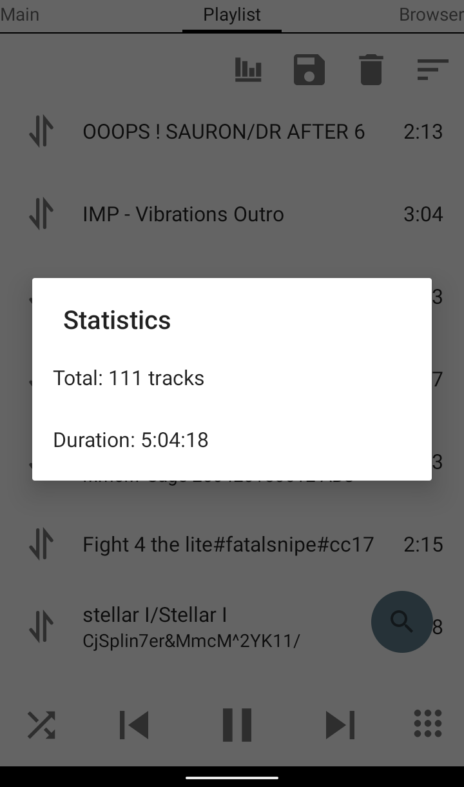
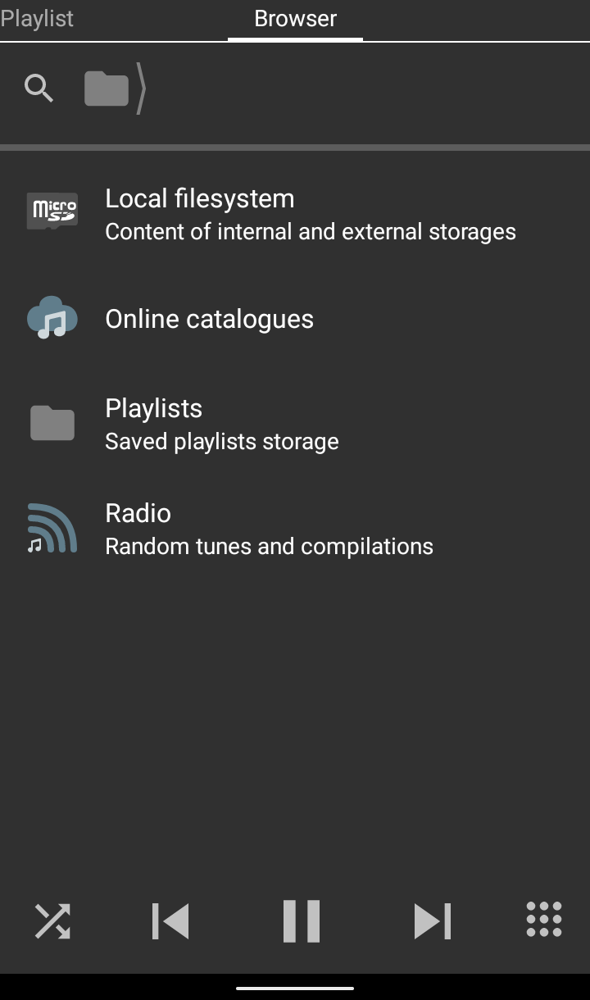
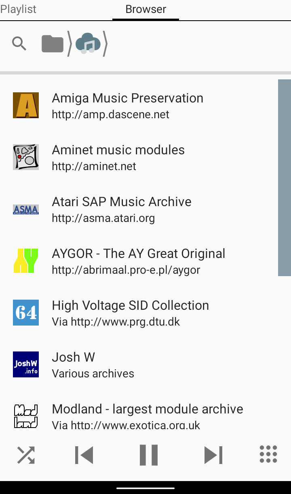

ZXTune
=========

ZXTune is open-source crossplatform chiptunes player.

## Screenshots

 ͏  ͏  ͏  ͏  ͏ 

---
Download [Official page](https://zxtune.ru) | [GooglePlay](https://play.google.com/store/apps/details?id=app.zxtune) | [RuStore](https://www.rustore.ru/catalog/app/app.zxtune) | [IzzyOnDroid](https://apt.izzysoft.de/packages/app.zxtune.fdroid)

Sources [BitBucket](https://bitbucket.org/zxtune/zxtune) | [GitHub](https://github.com/vitamin-caig/zxtune)

News [Telegram](https://t.me/zxtune_official) | [ВКонтакте](https://vk.com/zxtune) | [X](https://x.com/ZXTune) | [Facebook](https://facebook.com/zxtune)
